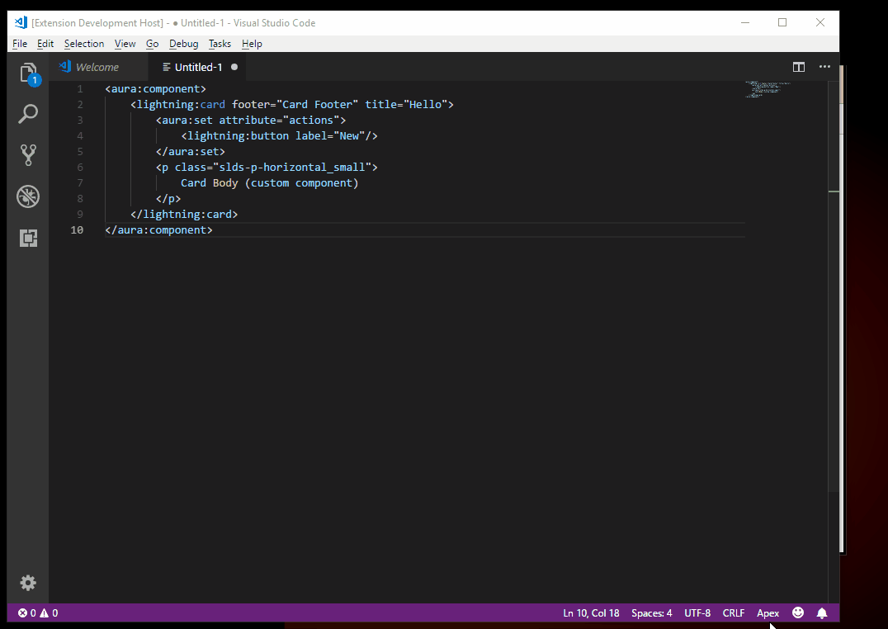

# cmp-doc

The cmp-doc extension provides a quick way to link to lighting component documentation. 
I found myself repeatedly referring to docs and wanted a quicker way to get to it. This is actually my hello world app for vscode extension development.

## Features

- links to the example page of the Component Library documentation
- if a component is no considered valid, it will link to the component home page.

## Get started

1. For the lightning:card component, highlight the text `lightning:card`.
1. From the command pallet, type `cmp-doc` and hit the ENTER key
1. Your default browser should then open the example documentation to the lighting:card.

## Known Issues

- It only works for components if you just highlight the text.
> For example: 
Highlighting the text: *`lightning:card`*  will work but it does not work if you highlight the full tag. If you highlight *`<lightning:card>`* with the angle brackets, it won't work.
    - 
- It does not open to the specficiation or documentation.
- Recognizes only aura and lightning tags
- testing 

## Release Notes

Users appreciate release notes as you update your extension.

### 1.0.0

Init and core functionality.
